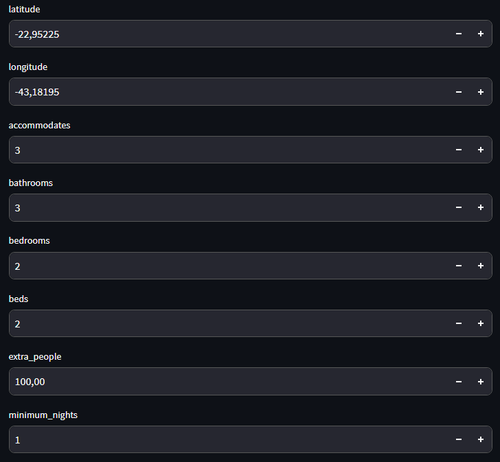
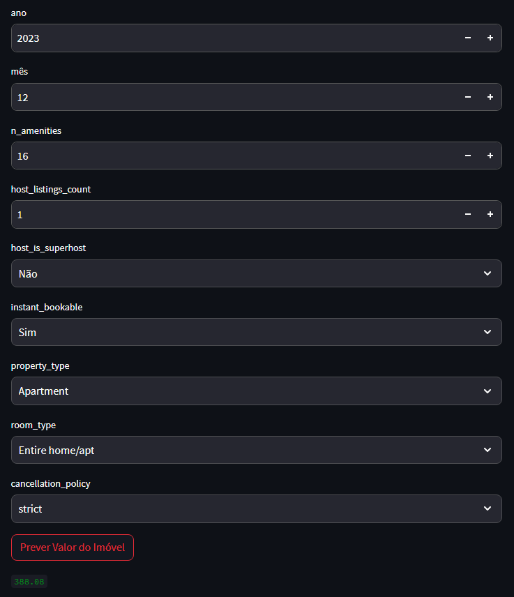

# Property Price Prediction Machine Learning

## Project Scenario Description

Airbnb is an american company operating online marketplace for short and long-term homestays
and experiences alike. The company acts as a broker and charges commissions from each booking.
By using Airbnb's services anyone who has a room or a property of any kind (apartment, house,
chalet, hostel, etc.) can offer their property to be rented out on a daily basis.

In the scenario where you are a property owner and wants to offer it for renting,
you create a profile as a host and an ad for your property. The ad must describe
the characteristics of the property as fully as possible, in order to help renters/travelers
choose the best property for them and also to make your ad more attractive. There are dozens
of possible customizations from minimum daily rate, price, number of rooms to cancellation
rules, extra fees for extra guests and requirement to verify the landlord's identity, etc.

## Project's Objective

To build a price prediction AI model that allows an average person who owns a property
to know how much they should charge per day for their property's renting.

Or even to allow them (given a certain type of property they are looking for) to know
whether that property is attractively priced (below the average for properties with the
same characteristics) or not.

### Inspiration and Database Source

The database was taken from kaggle (https://www.kaggle.com/allanbruno/airbnb-rio-de-janeiro)
containing Airbnb's data regarding Rio de Janeiro city properties.

This project was inspired by the following project: https://www.kaggle.com/allanbruno/helping-regular-people-price-listings-on-airbnb

### Packages used:
+ sklearn.metrics
+ sklearn.linear_model
+ sklearn.ensemble
+ sklearn.model_selection
+ pandas
+ pathlib
+ numpy
+ seaborn
+ matplotlib.pyplot
+ plotly.express
+ joblib
+ streamlit

## The Database

The database contains .csv files from April 2018 to September 2019 containing 108 different
features from properties located in Rio de Janeiro. After a qualitative analysis the features
were reduced to 34. The analysis excluded features following these criteria:

1) IDs, Links, and information not relevant to the model;
2) Repeated or redundant information;
3) Columns filled with long descriptive text;
4) Columns where all or almost all values are equal.

## Handling Empty Values

Visualizing the data we realize that there is a large disparity in missing data.
Columns with more than 300,000 NaN values were excluded from the analysis;

For the other columns with relatively small amount of NaN values the rows 
containing NaN data were deleted (since we have over 900,000 rows of data).
After this second analysis the database was left with 23 features.

## Exploratory Data Analysis (EDA)

 In this project the EDA will have 3 major objectives:

1) See the correlation between the features and decide if we will keep all the features we have;
2) Exclude outliers by following the Interquartile Range Rule;
3) Confirm if all the features we have really make sense for our model or
if any of them won't help us and if we should delete them.

There are 3 different types of features to be analyzed: Continuous Numeric Values
(e.g. monetary value), Discrete Numeric Values (e.g. number of bedrooms) and Categories
(e.g. property type).

## Machine Learning

With the database ready it's time to start the Machine Learning process which consists of:

1) Defining the Algorithms for the AI Model creation which are: Random Forest,
Linear Regression and Extra Trees;
2) Separating the database into Training Data and Testing Data;
3) Training the AI Models;
4) Evaluating and choosing the best AI Model.

## Project Deployment

The last step is to deploy the project. For that purpose we will export the processed database
to a .csv file and convert chosen AI Model to a file by using the joblib package. The deployed 
project will utilize the processed database for the Property Price Prediction.

"DeployProjetoAirbnb.py" is the Python Script responsible for this project deployment.

As shown in the images the AI Model can be used by inserting the proper information in each
gap, and by pressing "Prever Valor do Imóvel" the predicted price will be displayed bellow.
